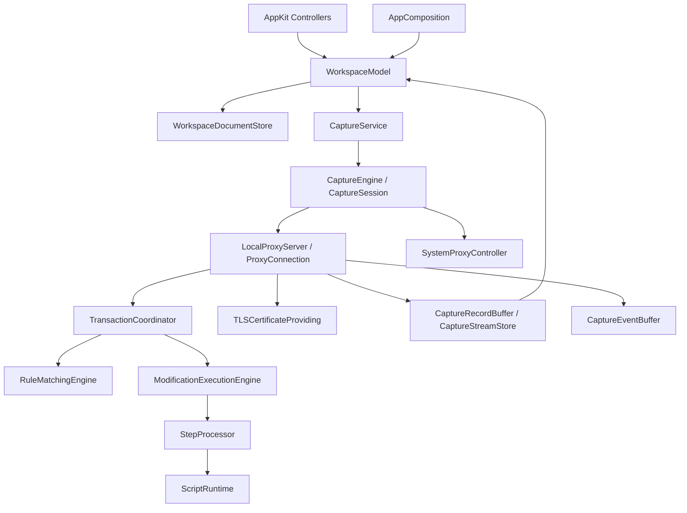

# 捕获与规则执行架构

宿主保留 AppKit MVC。业务层划分为捕获、规则匹配、修改执行三个入口，每种修改步骤由独立 Processor 实现。这里描述代码职责；产品行为仍以各功能设计文档为准。

## 调用关系

`LocalProxyServer` 是当前 HTTP/CONNECT 传输实现，不再增加只转发同名方法的 `ProxyTransport` 包装。捕获会话、HTTP 连接、单个请求事务是不同的生命周期；keep-alive 连接可以承载多个事务。

## 模块职责

| 组件 | 拥有的职责 | 不承担的职责 |
| --- | --- | --- |
| AppComposition | 组装工作区存储、捕获服务、共享证书 actor 和通知适配器 | 用户状态、规则执行 |
| WorkspaceModel | 页面选择、编辑操作、保存与捕获命令协调 | socket、证书生成、步骤算法 |
| CaptureEngine | 会话启停、重配、接管与恢复 | HTTP 报文解析、具体修改算法 |
| TransactionCoordinator | 原始请求匹配、事务上下文、双向执行和结果 | NIO Channel、控件、系统通知 |
| RuleMatchingEngine | 首个有效规则选择、条件匹配入口 | 修改消息、网络 I/O |
| ModificationExecutionEngine | 顺序执行、阶段校验、取消、步骤原子提交、执行结果和 trace | 上游连接、日志 UI |
| StepProcessor | 一种修改操作的校验与执行 | 读取可变全局配置、管理会话 |
| LocalProxyServer / ProxyConnection | 监听、连接、协议升级、正文读取、写入背压、记录快照 | 规则算法和步骤分发实现 |

## 事务与执行契约

`TransactionContext` 保存原始请求、匹配结果、环境、模板上下文和取消信号。两阶段共用同一快照；后续工作区更新只影响新事务。当前阶段的 `HTTPMessageDraft` 独立可变，不能覆盖原始匹配输入。

`FlowExecutionPlan` 根据可达的启用步骤生成各阶段需求：是否需要完整正文、是否含脚本、延迟或文件 I/O、是否需要后台执行。请求阶段在首个 Mock / Redirect 后停止聚合，响应 Redirect 不终止后续步骤。它复用原有 Body mode 与环境快照类型，不再建立第二套计划模型。

| 操作 | 数据与调度约束 |
| --- | --- |
| Header / Method / URL / Status / 静态 Body | 元数据或配置值即可；保持快速流式路径 |
| 本地 Body 文件 | 后台读取文件，不要求先读完原正文 |
| Script | 完整正文路径和独立工作进程；使用脚本准入名额 |
| Delay | 可取消异步等待，不占脚本名额；普通响应与 SSE 的读取策略由传输层协调 |

每步在草稿副本上执行，成功才提交。后续步骤失败保留此前成功步骤；失败步骤不留下半次修改。引擎停止当前流程并传播原错误，代理沿现有错误响应或关闭连接路径处理。已经发送到网络的数据不能回滚。

`ModificationExecutionResult` 返回步骤 trace 和 `ExecutionDisposition`：请求阶段可以继续上游或产生本地响应，Mock / 请求重定向结束请求阶段，再执行响应阶段。响应阶段的重定向继续遵循原有有序执行语义。

`StepExecutionTrace` 关联步骤 ID、阶段、耗时及 applied / failed / cancelled 状态。`CaptureRecord.executionTrace` 关联所在事务；原有步骤标题和命中摘要仅保留成功步骤，继续供界面显示。`TransactionTraceRecorder` 在后台执行时即时收集 trace，连接关闭后的取消结果仍可更新同一条终态记录；更新保留清空代次，不依赖已经停止的 event loop。

## 传输与生命周期

系统模式先监听再接管，先恢复再停止；恢复失败保留监听。浏览器模式只监听并启动显式代理浏览器，正常会话不读写系统代理。异常退出恢复独立于新会话启动。

全部连接可变状态固定在 NIO event loop。后台工作只接收值快照，完成后回到原 event loop，并检查事务身份和取消状态。不得让上一事务的结果写入 keep-alive 下一事务。

SSE 由原始上游响应识别。延迟不能等待无限流 EOF；有限 Body 替换可以取消原上游。WebSocket 握手后切换帧转发，消息记录由会话对象持有。HTTP 修改 Processor 不被当成 WebSocket 消息处理器。

当前 HTTP 事务没有总时限，保留连接建立和空闲时限。`FlowExecutionRuntime` 仍是独立的有界操作工具，其整体超时和准入队列不包裹实际代理；生产路径复用 `FlowExecutionPlan`，不叠加第二套调度。

## 记录、事件与存储

- `WorkspaceDocumentStore` 串行保存 JSON 配置；偏好继续使用 UserDefaults。
- `CaptureRecordBuffer` 合并事务快照，支持暂停与清空代次；宿主按批消费到有限内存历史。
- `CaptureStreamStore` 持有持续消息的临时文件，异步写入、按页读取，生命周期由引用所有权管理。
- `CaptureEventBuffer` 发布会话与事务事件，独立于日志暂停和清空；慢消费者淘汰旧事件并返回丢失数量。它是诊断通道，不是持久审计日志。
- `RuleHitNotificationBuffer` 保留独立的会话隔离与固定窗口聚合，宿主负责系统通知。

当前没有历史数据库，也没有透明接管扩展。既有存储实现保持独立职责，不为未来数据库添加空实现。

## 目录与演进约束

Core 内按类型拆分 `RuleMatchingEngine`、`ModificationExecutionEngine`、上下文、结果、模板、HTTP 校验和各 Processor。`WorkflowEngine` 只保留兼容委托，业务实现不回填其中。

Proxy 内独立保存会话、事务协调器、共享连接状态与协议处理文件。`ProxyConnection` 的请求、响应、执行桥、记录、SSE、CONNECT、WebSocket 按职责分文件；跨文件方法是模块内部实现，仍由同一个事件循环拥有。

宿主的 `WorkspaceModel` 本体保存状态和注入依赖，Capture / Persistence / Editing 扩展分别负责命令，日志模型独立。新增操作先归入现有职责，避免重新堆到主文件。

验证以 Core 行为测试、代理回环集成测试、宿主 typecheck 和受影响的隐藏 AppKit 组件检查为准。这些检查不代表完整 App、真实浏览器或系统授权验收。
