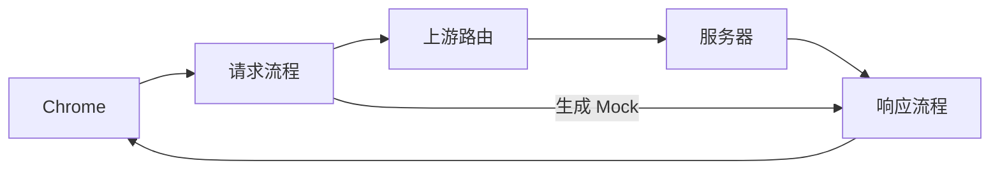

# Requestman macOS 产品与技术设计草案

> 实现进度（2026-09-25）：原生三栏工作区、环境、基础双向 HTTP 修改与全局内存记录已接入。HTTPS 当前仅 CONNECT 透传；脚本、辅助请求、断点等仍为后续目标。以 [macOS README](../README.md) 的能力表为准。
更新日期：2026-09-24。状态：第一版讨论稿；本文定义目标与建议，不代表功能已实现。

当前实现状态见 [macOS README](../README.md)，网络接入、Surge 共存和系统扩展边界见 [Architecture.md](Architecture.md)。

## 1. 产品定位与已确认方向

Requestman 主要辅助 Chrome 进行 Web 开发：在浏览器与服务器之间，编排请求出站和响应回站的处理流程。Chrome DevTools 继续用于网页调试和查看最终响应，Requestman 用于配置修改流程、管理环境，以及检查浏览器看不到的代理处理过程。

| 方向 | 约定 |
| --- | --- |
| 主要场景 | Chrome Web 开发；先跑通 Chrome 的完整链路 |
| 两条路径 | 请求流程负责“去”，响应流程负责“回” |
| 自动执行 | 静态修改、动态取值、脚本、辅助 HTTP 请求、Mock 都是一等能力 |
| 人工操作 | 可在流程中暂停、编辑、继续；不是每次修改的必要步骤 |
| 修改范围 | HTTP 应用层的目标地址、方法、Header、Body、响应状态码等 |
| 浏览器展示 | 请求侧显示 Chrome 原始发送内容；响应侧显示最终返回 Chrome 的内容 |
| 运行解释 | 展示流程命中、节点执行、修改差异、辅助请求、等待与错误 |
| 上游出口 | 支持显式 HTTP 上游代理，与 Surge 共存 |

本文后续的模块命名、脚本 API、默认执行语义和第三方库均为设计建议。接入方式、代理核心及分发方式需要技术验证后定案。

当前 macOS 只有 SwiftUI 宿主骨架、运行中 GUI 应用列表、连接配置草稿和 `RequestmanCore` 契约；没有真实捕获、流程执行、证书管理和持久化。浏览器扩展独立构建和发布，不能将其页面注入代码直接作为原生代理引擎。

执行资源基础已开始落地：按需 Body 计划、有界准入/缓冲预算、取消与截止时间、元数据记录通道已在核心包实现，见 [性能与资源边界](Performance.md)。这不包含完整流程动作解释器，也尚未接入真实网络。

## 2. Chrome Network 的展示契约

以下预期适用于实际经过 Requestman、且最终响应由 Requestman 返回 Chrome 的网络请求。它们是实现后的验收要求，目前未通过运行测试证明。

| Requestman 的操作 | Chrome Network 的预期表现 |
| --- | --- |
| 修改请求 Header、方法、Query、Body | 显示 Chrome 发出的原始请求，看不到代理内部修改 |
| 内部更换目标服务器 | 仍显示 Chrome 请求的原 URL |
| 修改响应状态码、Header、Body | 显示返回 Chrome 的修改后结果 |
| 直接生成 Mock | 显示 Mock 的状态码、Header、Body |
| 返回 `3xx + Location` | Chrome 根据自身跳转策略处理，通常产生后续请求 |
| 辅助 HTTP 请求 | 不出现在 Chrome Network；归入 Requestman 的请求日志 |
| 暂停或延迟 | 原请求等待，耗时增加，客户端仍可能超时或取消 |

Chrome 的 Copy as cURL 反映浏览器侧请求，不能用来证明最终上游请求。App 需要提供查看最终上游请求的能力。

浏览器缓存、Service Worker、本地 Overrides 等可能让内容不经过 Requestman，或再次改变浏览器侧结果。验收时排除这些干扰，并分别记录请求来源。CORS、Cookie 和浏览器其他响应处理规则仍然生效；修改网络响应不等于页面脚本必然可以读取它。

修改必须发生在响应进入 Chrome 网络栈之前。仅包装页面 `fetch` 或 XHR 的返回对象，不能承担 Network 面板展示最终改写结果的契约。

## 3. 双向流程模型



一次浏览器请求建立一个执行实例。请求流程处理浏览器原始请求，发送最终请求；响应流程处理服务器响应或本地生成的响应，返回最终结果。两条路径共享本次实例的变量和追踪信息。

正常路径为：匹配与固定执行计划 → 请求节点 → 上游请求 → 响应节点 → 返回 Chrome。Mock 在请求阶段生成响应并转入响应流程，不访问目标服务器；响应来源标记为 `server` 或 `mock`，后续节点可按来源过滤。

内部转发与 HTTP 重定向是两个不同动作：前者只改变代理访问的目标，后者返回 `3xx + Location`，由浏览器决定是否发起新的请求。状态码属于响应，也可以在请求流程中通过 Mock 提前生成。

### 3.1 流程配置与运行实例

| 概念 | 职责 |
| --- | --- |
| FlowDefinition | 稳定 ID、版本、启用状态、匹配条件、请求步骤、响应步骤 |
| ExecutionPlan | 为本次请求固定的流程集合、顺序和环境版本 |
| ExecutionContext | 原始与当前请求/响应、局部变量、节点输出、剩余时间、取消状态 |
| StepDefinition | 节点类型、输入、动态值、分支、失败策略 |
| ExecutionTrace | 节点起止时间、结果、修改差异、错误和辅助请求关联 |

配置在运行前校验；编辑或停用流程不修改已开始实例的计划。停止捕获和取消实例是另外的显式操作。

### 3.2 节点类型

| 节点 | 请求路径 | 响应路径 |
| --- | --- | --- |
| 条件分支 | 应用、URL、方法、Header、变量 | 原请求上下文、状态码、Header、响应来源、变量 |
| 字段修改 | 协议、域名、端口、路径、Query、方法、Header、Body | 状态码、Header、Body |
| 变量赋值 | 固定值、提取、计算 | 请求/响应提取、计算 |
| HTTP Call | 发起辅助请求并提取输出 | 发起辅助请求并提取输出 |
| Script | 计算或转换请求，生成响应 | 计算或转换响应 |
| Delay | 延迟继续执行 | 延迟继续执行 |
| Breakpoint | 人工检查和编辑后继续 | 人工检查和编辑后继续 |
| Mock | 生成响应，结束请求路径并转入响应路径 | 整体替换当前响应，继续后续响应节点 |
| 终止动作 | 发送上游或中止请求 | 返回客户端或中止响应 |

响应路径不能返回已经结束的请求路径；响应 Mock 不重新进入响应流程，防止递归执行。

### 3.3 建议的首版执行语义

- 流程按显式顺序排列；入口匹配以浏览器原始请求为基准，节点内可选择读取原始值或当前值。
- 多条命中流程形成有序执行计划。响应阶段沿用本次计划，并以响应条件决定是否执行节点，不按中途改变的配置重新匹配。
- 默认顺序执行，支持有限条件分支；不提供任意回边、循环或隐式并行。
- Mock、中止、发送上游等终止当前阶段的动作，不继续执行该阶段剩余步骤。
- 每次请求最多发送一次主上游请求。辅助 HTTP 请求单独标记；主请求重试/重放需另行设计。
- 人工编辑提交后，后续节点读取修改后的当前值，不重新运行此前已完成节点。
- 失败策略显式选择：中止、继续使用该节点执行前的值、采用备用值，或生成错误响应；不静默忽略失败。
- 动态值缺失、类型错误、非法状态码、悬空节点引用在校验或执行时给出具体位置。

以上语义需要固化为测试样例，尤其要解释旧规则迁移后的行为差异。

## 4. 动态字段与变量

所有可编辑字段使用统一的 `ValueExpression` 概念，不能只在 Header 中支持变量。

| 来源 | 设计示例 | 用途 |
| --- | --- | --- |
| Literal | `application/json` | 固定值 |
| Environment | `env.baseURL` | 环境配置 |
| Secret reference | `secrets.password` | 敏感值引用 |
| Context reference | `request.original.url`、`response.current.status` | 当前处理上下文 |
| Variable / step output | `vars.token`、`steps.auth.response.status` | 复用先前结果 |
| Built-in | 时间、UUID、随机值、哈希 | 自动计算 |
| Template | `Bearer {{vars.token}}` | 字符串组合 |
| Script result | 返回字符串、数值、对象或字节数据 | 自定义取值 |

上述命名是设计示意，不是已发布语法。HTTP 调用作为可追踪节点执行，再通过引用获取结果；字段模板本身不隐藏额外的网络副作用。

类型需要保留：Header 最终为字符串，状态码为合法整数，JSON 字段可接收对象、数组、数值和布尔值。JSON 结构化赋值与纯文本模板分开，避免引号、转义和类型错误。Body 支持文本、JSON、表单、multipart 和文件/二进制替换。

环境在实例开始时取快照。`vars` 和 `steps` 仅属于当前实例，不与并发请求共享可变状态。跨请求共享只通过明确的缓存能力实现。

动态值在对应节点执行时求值。同一时间戳、UUID 或签名材料需要多处使用时，先赋值一次再引用；预览使用独立上下文，不能消耗实际执行值。节点只能引用已执行步骤的输出，分支中未产生的值需要明确备用值。

密钥通过引用访问，流程导出和普通执行日志不直接携带密钥原文。

## 5. 脚本和辅助请求

字段脚本返回一个值，流程脚本可以修改多个字段、异步调用接口或生成响应。脚本仅获得约定的上下文和宿主 API，不假设存在 DOM、`window` 或浏览器原生 `fetch`。

设计示例：

```javascript
// 拟议 API，用于说明能力；当前不可运行。
async function onRequest(ctx) {
  const auth = await ctx.http.send({
    url: `${ctx.env.authURL}/token`,
    method: "POST",
    json: { account: ctx.env.account, password: ctx.secrets.password }
  });
  ctx.vars.token = auth.json.access_token;
  ctx.vars.timestamp = ctx.now();
  ctx.request.headers.set("Authorization", `Bearer ${ctx.vars.token}`);
  ctx.request.headers.set("X-Timestamp", String(ctx.vars.timestamp));
}
```

HTTP Call 与脚本的 `ctx.http.send` 共用辅助请求服务，统一负责：

- URL、方法、Header、Body 的动态输入，以及状态码、Header、Body 的结果提取。
- 超时、响应体上限、取消、错误传播和确定的上游路由。
- 标记为辅助流量，默认跳过普通流程匹配，避免认证请求递归触发自身。
- 作为主请求的子记录展示；辅助请求不会出现在 Chrome Network。
- 可选缓存，按环境、账号和相关输入区分键，配置过期和失效策略；同键并发获取可合并。
- 显式重试策略；有副作用的调用不默认重试，超时也不能推断服务器没有执行。

脚本执行必须有可终止的运行边界。CPU 死循环和悬挂的异步操作不能阻塞 UI 或代理事件循环；超时/取消后拒绝迟到结果，并在必要时终止、重建执行进程。终止共享工作进程时也要处理其余受影响任务，具体隔离粒度待验证。

## 6. 人工断点、流式处理与连接生命周期

断点暂停单个请求或 HTTP/2 流，不阻塞整个引擎。原始内容只读，编辑写入草稿，放行时校验并提交确定版本。允许原样继续、修改后继续、生成 Mock 或中止。

暂停不会停止浏览器、页面代码或服务器的超时计时。节点超时、人工等待和辅助请求都受本次执行时间预算约束；客户端取消后传播取消，禁止尚未发送的主请求继续出站。已经发给服务器的操作不能靠响应断点撤销。

建议区分三种处理模式：

| 模式 | 行为 |
| --- | --- |
| 流式透传 | 不需整体 Body 修改时，按背压转发，记录只保留受限预览 |
| 头部阶段处理 | 在发送头部前修改方法、状态码或 Header，Body 可继续流式传输 |
| 完整 Body 处理 | 在向下一跳发送头部/Body 前缓冲完整内容，必要时落盘，然后编辑或整体替换 |

完整 Body 处理有明确大小和等待上限；超限时按节点策略结束或退回允许的透传路径，不能无界缓冲。SSE 等持续响应不应默认等待完整 Body。响应头部发出后，不能再承诺修改状态码或执行整体响应替换；首版不提供任意流式脚本变换。

修改 Host/`:authority`、目标连接、TLS 域名、长度、压缩和缓存校验相关 Header 时，由引擎保持协议一致。重复 Header 和 Query 不用普通字典丢失；`HEAD`、`204` 等响应限制需校验。HTTP/2 流编号、TLS 加密帧不属于普通编辑字段。

## 7. 功能模块与交互

| 模块 | 主要内容 |
| --- | --- |
| 流程工作台 | 分组、启停、排序、匹配条件、请求/响应步骤、分支、动态值编辑 |
| 快捷规则模板 | 添加 Header、切换环境、改写 URL、返回 JSON 等单步骤流程 |
| 环境管理 | 环境配置、密钥引用、变量预览 |
| 请求日志 | Chrome 原始请求、最终上游请求、服务器原始响应、最终客户端响应四个逻辑视图 |
| 节点追踪 | 命中原因、耗时、输入输出摘要、修改差异、辅助请求、错误 |
| 待处理断点 | 等待列表、草稿、差异、放行/取消、客户端连接是否有效 |
| 接入与连接 | Chrome 接入、捕获状态、上游代理、连接诊断；后续按应用接管 |
| HTTPS 与证书 | CA、信任状态、域名解密范围、更新与移除 |
| 数据与配置 | 持久化、记录容量和清理、版本化导入导出 |

首版编辑器采用请求/响应两个区域内的有序步骤列表；条件分支用明确的嵌套结构表示。底层保留流程模型，复杂画布不是首版必要条件。

记录四个逻辑视图不意味着复制四份完整 Body，可使用文件引用和差异。Mock 没有服务器原始响应，应显示“未访问上游”。分别控制记录暂停与流程启停；暂停列表记录不应隐式停止 Mock。

流程测试调用实际执行器。默认离线预览使用样例上下文和辅助请求桩，不在编辑时自动发网络请求；真实联调是明确动作，并展示实际副作用和结果。

## 8. 技术架构与选型建议

```text
SwiftUI Features → 功能状态模型 → CaptureService / 流程配置服务
                                      ↓ 带版本的控制 IPC
显式代理入口 / Transparent Proxy → ProxyEngine
                                      ↓
                        RuleMatcher → ExecutionPlan
                                      ↓
                             ExecutionCoordinator
                           ├─ ValueResolver
                           ├─ ScriptRuntime
                           ├─ AuxiliaryHTTPClient
                           └─ InterceptionQueue
                                      ↓
                       UpstreamRouter / 客户端响应

执行事件 → TrafficStore → UI 查询与批量更新
CertificateService → TLS 证书与信任支持
```

宿主负责配置和用户操作；独立代理进程负责协议和执行；系统扩展仅在透明接管模式下负责来源识别和流量桥接。UI 不参与每个数据块的转发，也不直接操作证书或 Network Extension。

| 领域 | 建议 | 定案前需要验证 |
| --- | --- | --- |
| UI 与状态 | 延续 SwiftUI、必要的 AppKit、Observation、`@MainActor` 功能模型 | 请求列表和编辑器性能 |
| 核心模块 | 在 RequestmanCore 定义 UI 无关模型与契约 | 与现有 CaptureService 的演进兼容 |
| 主代理候选 | SwiftNIO、NIOHTTP1、NIOHTTP2、NIOSSL | 双向 TLS、CONNECT、流桥接、HTTP/2、背压与 Surge 上游 |
| 替代代理候选 | mitmproxy 独立进程 | 嵌入分发、运行时体积、IPC、许可证、本地接管与上游组合 |
| Chrome 接入 | 优先验证显式代理；按应用透明接管作为另一适配器 | HTTPS 信任、Chrome 代理路径及回环/绕过行为 |
| 按应用接管 | NETransparentProxyProvider + System Extension | 签名、授权、来源身份、辅助进程、退出恢复 |
| 控制通信 | XPC + 版本化契约、身份校验 | 引擎/扩展生命周期、重连、配置确认 |
| 流量通信 | 有边界和背压的本地数据通道，评估 Unix domain socket | 扩展沙箱访问、吞吐、取消、断线行为 |
| 存储 | SQLite + GRDB；Body 独立文件 | 单一写入服务、分页、批量写入和清理 |
| 脚本 | JavaScriptCore + 隔离工作进程 | 异步宿主 API、可终止执行、并发隔离 |
| 证书 | Security/Keychain，评估 swift-certificates | CA 签名与 NIOSSL 私钥接口的衔接 |
| 分发 | 优先评估 Developer ID 签名、公证；透明接管采用 System Extension | 授权、升级、卸载和签名能力 |

SwiftNIO 是网络基础设施，不是完整 MITM 引擎。使用成熟 TLS/HTTP 库仍需实现代理协议、连接管理和兼容性处理。mitmproxy 分别支持本地接管和上游模式，不代表本项目要求的组合已经验证。当前不锁定第三方包版本，也不新增依赖。

先按职责分目录，出现复用或独立测试需求再拆 Package。浏览器扩展与原生客户端共享的是未来的交换契约和测试样例，不默认共享执行代码。

## 9. 从现有扩展迁移

| 扩展能力 | 原生流程表达 |
| --- | --- |
| 重定向、URL 字符串重写、Query 修改 | 请求字段修改节点；文件替换转为 Mock |
| 请求体/响应体静态与动态修改 | Body 修改节点或 Script |
| 请求头/响应头、User-Agent | Header 修改节点，保留 UA 快捷模板 |
| 取消请求 | 中止节点，与返回 HTTP 错误 Mock 区分 |
| 请求延迟 | Delay 节点 |
| 分组、排序、开关、导入导出 | 流程管理与版本化交换格式 |

现有响应体改写先访问服务器，不等于离线 Mock，也不默认支持状态码替换。当前注入层多条延迟取最大值，Body 转换可依次叠加；原生顺序节点不能未经转换便声称语义兼容。

页面域名、XHR/图片/iframe 等浏览器上下文不能由普通代理准确恢复。未来导入器必须列出支持、需转换和不支持的条件；不能静默删除条件而扩大匹配范围。当前不承诺两端 JSON 直接互通。

## 10. 难点、实现顺序与验收

主要风险集中在真实网络行为：Chrome 代理接入、HTTPS 信任、HTTP/2 流生命周期、流式内容、动态执行超时、脚本终止、Surge 路由和进程归属。证书绑定、自定义信任库、双向 TLS、HTTP/3、WebSocket 消息编辑和 gRPC 语义编辑分别定义能力边界，不作为首版通用承诺。

Surge 的系统代理、增强模式、Fake IP、MITM、按进程分流与循环排除要求沿用 [Architecture.md](Architecture.md#surge-共存)。系统路由不保证绕过 Surge；显式上游失败不能静默换出口。代理崩溃后，已经接管的连接不能承诺无缝恢复，已有连接和后续新连接分别处理。

| 阶段 | 交付与完成判据 |
| --- | --- |
| A：技术验证 | Chrome 经显式代理访问真实 HTTPS；Network 显示修改后状态码/Header/Body；上游服务证明收到改写后请求；静态 Mock 无主上游访问；Surge 指定出口可用 |
| B：最小流程闭环 | 双向顺序步骤、条件分支、静态修改、Mock、环境变量、基本执行追踪和持久化 |
| C：首版能力补齐 | 动态计算、异步脚本、辅助请求、人工断点、超时取消、流式边界、旧能力模板和版本化导入导出 |
| D：接入与调试扩展 | 按应用透明接管、辅助进程识别、更多协议、重放/HAR 等按需求推进 |

阶段 B 是中间里程碑，不代表已经满足异步流程与人工断点的完整需求。通用按应用接管不阻塞 Chrome 主场景；显式代理与透明接管复用处理引擎。

首版验收至少覆盖：

1. 请求修改：Chrome 显示原始请求，受控服务器和 App 记录显示改写后的目标、方法、Header、Body。
2. 响应修改：Chrome Network 显示修改后的状态码、Header、Body，页面在浏览器规则允许时消费该结果。
3. Mock：目标接口服务端计数不增加；Mock 进入响应流程且来源可识别。
4. 动态链路：环境 → 认证辅助请求 → Token 提取 → 时间戳/签名 → 主请求；并发实例变量不串用。
5. 断点：请求/响应分别暂停、编辑、继续；客户端超时后拒绝过期放行，未发出的主请求不继续执行。
6. 失败与恢复：脚本异常/死循环、辅助请求超时、上游失效、停止捕获、退出和进程崩溃均有明确结果。
7. 大数据与协议：Body 超限、压缩响应、重复 Header、HTTP/2 并发取消、SSE 透传不造成无界缓冲或整连接误杀。
8. Chrome 干扰项：区分缓存、Service Worker 和本地 Overrides，避免假命中或假失败。
9. Surge：覆盖关闭、仅系统代理、仅增强模式、两者同时启用、目标域名 MITM、按进程规则及上游故障。

纯流程和动态值用单元测试验证；HTTP/TLS 与代理连接用受控服务验证；Chrome 展示、证书信任和 Surge 共存单独记录运行证据。遵守项目验证约束，不通过 Xcode/xcodebuild 编译并部署 App 到真机运行测试，也不拆分命令绕过。

## 11. 后续需要收敛的决策

- 主代理引擎采用 SwiftNIO 实现还是嵌入 mitmproxy，以完整链路原型和维护成本决定。
- Chrome 专用调试窗口已接入；开始捕获时接管系统 HTTP/HTTPS 代理，停止/退出与异常退出后重启时恢复。系统授权及 Surge 共存仍待人工验收，不修改 Surge 配置或证书信任。
- 动态字段语法、脚本 API、流程交换格式，以及多流程/终止动作的正式兼容契约。
- 默认执行时限、Body 上限、记录保留容量、失败策略和脚本工作进程隔离粒度。
- 首版 HTTP/2 和流式内容的具体覆盖范围；不支持协议的透传或错误策略。

## 参考资料

- [Chrome Network 功能参考](https://developer.chrome.com/docs/devtools/network/reference)
- [Apple Network Extension 部署要求](https://developer.apple.com/documentation/technotes/tn3134-network-extension-provider-deployment)
- [SwiftNIO](https://github.com/apple/swift-nio)、[NIOHTTP2](https://github.com/apple/swift-nio-http2)、[NIOSSL](https://github.com/apple/swift-nio-ssl)
- [GRDB](https://github.com/groue/GRDB.swift)、[swift-certificates](https://github.com/apple/swift-certificates)
- [JavaScriptCore JSContext](https://developer.apple.com/documentation/javascriptcore/jscontext)
- [mitmproxy 代理模式](https://docs.mitmproxy.org/stable/concepts/modes/)、[macOS 本地接管](https://www.mitmproxy.org/posts/local-capture/macos/)
